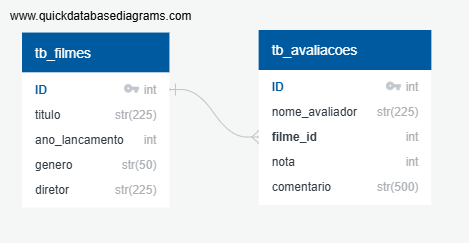
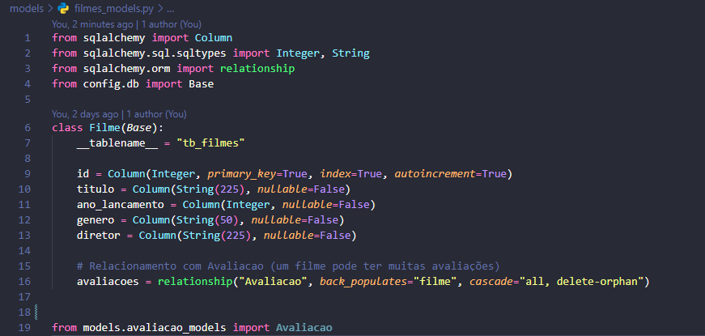
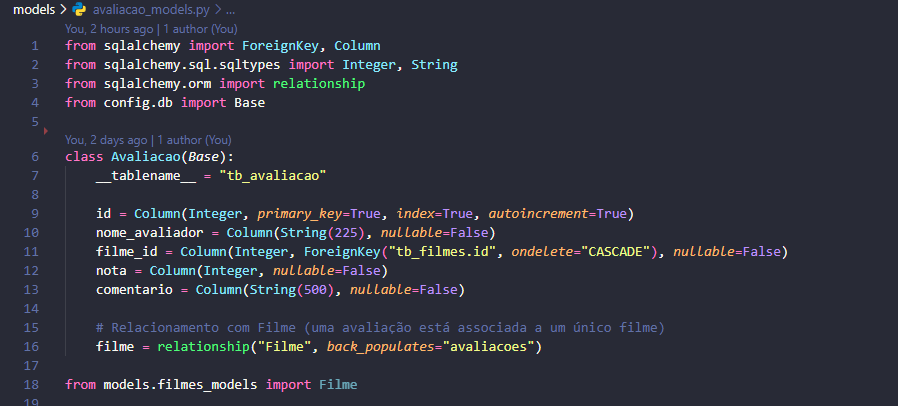
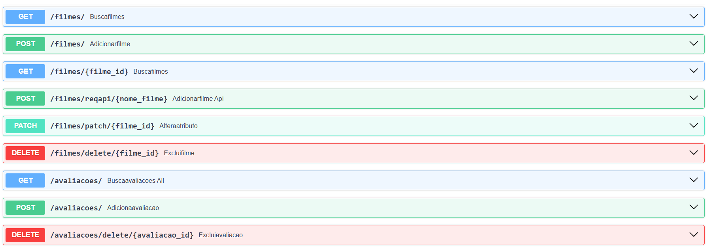

# 
Sistema de Filmes e Avaliações

## Descrição

Este projeto implementa um sistema de cadastro de filmes e avaliações de usuários, permitindo que os filmes sejam avaliados com uma nota de 1 a 10 e acompanhados de um comentário. O sistema foi desenvolvido com FastAPI para a API e SQLAlchemy para a interação com o banco de dados relacional. O banco de dados armazena informações sobre filmes e avaliações. 

 

## Tecnologias Utilizadas
- FastAPI: Framework Python para criação da API.
- SQLAlchemy: ORM para integração com banco de dados relacional.
- MySQL: Banco de dados utilizado.
- Pydantic: Validação e serialização de dados.
- Uvicorn: Servidor ASGI para rodar a aplicação.

 

## Estrutura do Banco de Dados

- ### Tabelas Criadas:
  - <strong>tb_filmes</strong>: Contém informações a respeito dos filmes, como título (nome), ano de lançamento, gênero (ação, aventura, etc) e diretor;
  - <strong>tb_avaliacoes</strong>: Informações sobre avaliações de cada filme, como nome do avaliador, nota, comentário e código ID do filme.

- ### Relacionamentos:
  - A tabela tb_avaliacoes está relacionada à tabela tb_filmes por intermédio da chave estrangeira "filme_id", através de uma relação muitos para um, ou seja, um filme pode ter diversas avaliações conectadas a ele.

- ### Modelagem do Banco de Dados:
  - Optei pela construção/modelagem das tabelas utilizando o SQLAlchemy (pastas config e models deste projeto), abaixo estão recortes dos scripts com os parâmetros e regras utilizadas.
  
   
   

 

## Automação e Escalabilidade
- ### Criação de Duas Camadas de Rotas
  - #### Rotas de filmes.py
    - <strong>GET/</strong> ➡️ Exibe todos os filmes presentes no banco de dados;
    - <strong>GET/{id}</strong> ➡️ Retorna o filme com base no id fornecido;
    - <strong>POST/</strong> ➡️ Cria um novo filme manualmente em tb_filmes;
    - <strong>POST/reqapi/{nome_filme}</strong> ➡️ Recebe nome do filme e faz requisição para a API de filmes OMDb, os dados são tratados e registrados automáticamente na tabela;
    - <strong>PATCH/{id}</strong> ➡️ Altera algum campo do filme com o id informado;
    - <strong>DELETE/{id}</strong> ➡️ Deleta registro com base no id informado.
  - #### Rotas de avaliacoes.py
    - <strong>GET/</strong> ➡️ Retorna todas as avaliações cadastradas em tb_avaliacoes;
    - <strong>POST/</strong> ➡️ Cadastra nova avaliação informando o id do filme a ser avaliado;
    - <strong>DELETE/</strong> ➡️ Deleta registro com base no id informado.
    
      

